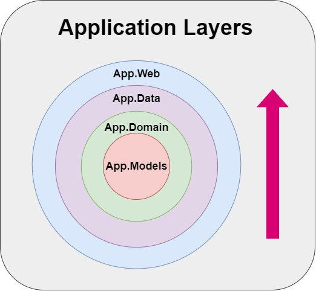
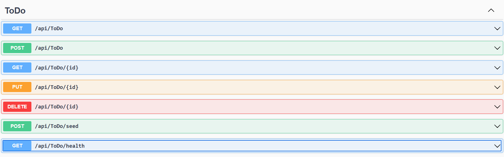

# ToDo API

This project is a ToDo management API built using Clean Architecture principles. It provides a RESTful API for managing ToDo items, including CRUD operations and seed data functionality. The application is developed using [ASP.NET Core](https://dotnet.microsoft.com/en-us/apps/aspnet) and [Entity FrameWork Core](https://learn.microsoft.com/en-us/aspnet/entity-framework)

<p align="center">

</p>

# Project Structure
The project follows Clean Architecture principles, which is developed based on the Dependency Injection Principle that promote separation of concerns and and make the application more maintainable. Here's a high-level overview of the project structure:

```Bash
src/
│
├── App.Data/ 
│   ├── AppDbContext.cs
│   ├── ConfigurationHelper.cs
│   └── DesignTimeDbContextFactory.cs
│
├── App.Domain/
│   ├── Services/
│   │   └── ToDo/
│   └── App.Domain.csproj
│
├── App.Infrastructure/
│   ├── SqlServer/
│   │   ├── SqlServerConfigureOptions.cs
│   │   └── SqlServerOptions.cs
│   └── InfrastructureServiceCollectionExtensions.cs
│
├── App.Models/
│   └── ToDoItem.cs
│
├── App.Web/
│   ├── Controllers/
│   │   ├── HealthCheckController.cs
│   │   └── ToDoController.cs
│   ├── Properties/
│   │   └── launchSettings.json
│   ├── App.Web.http
│   └── Program.cs
│
├── .gitignore
├── CleanApp.sln
└── README.md
```

# Application Structure
- **<font color='blue'> App.Web : </font>** Contains the .NET Core API controllers that handle HTTP requests.
- **<font color='red'>App.Data : </font>** Contains the Entity Framework Core DbContext and database configuration.
- **<font color='orange'>App.Domain : </font>** Contains the service layer that includes the business logic for managing ToDo items.
- **<font color='green'>App.Models : </font>** Contains the ToDoItem model. 

<p align="center">

</p>

## Endpoints

#### Get All ToDo Items

- **URL**: `/api/todo`
- **Method**: `GET`
- **Description**: Retrieves all ToDo items.

### Get ToDo Item by ID

- **URL**: `/api/todo/{id}`
- **Method**: `GET`
- **Description**: Retrieves a specific ToDo item by its ID
- **Parameters:** `id`(int): The ID of the ToDo item.

### Create ToDo Item

- **URL**: `/api/todo`
- **Method**: `POST`
- **Description**: Creates a new ToDo item.
- **Body**: The ToDo JSON Object to be created.
  
### Update ToDo Item

- **URL**: `/api/todo/{id}`
- **Method**: `PUT`
- **Description**: Updates an existing ToDo item.
- **Parameters:** `id`(int): The ID of the ToDo item.
- **Body**: The ToDo JSON Object to be updated.

### Delete ToDo Item

- **URL**: `/api/todo/{id}`
- **Method**: `DELETE`
- **Description**: Deletes a ToDo item by ID.
- **Parameters:** `id`(int): The ID of the ToDo item.


### Seed Data

- **URL**: `/api/todo/seed`
- **Method**: `POST`
- **Description**: Seeds the database with a list of hardcoded ToDoItems.

### Health Check
- **URL**: `/api/todo/health`
- **Method**: `POST`
- **Description**: Provides a simple health check endpoint to verify if the API is running.



--- 

# Setup
***1. Clone the repository*** 
```bash
git clone https://github.com/ZahraneRabhi/DOTNET-CORE-CLEAN-ARCHITECTURE.git
cd todo-api
```

***2. Install dependencies(NuGet Package Manager)*** 
dotnet ef migrations add InitialCreate
dotnet ef database update

***3. Update the connection string*** 

- Update the connection string in ```App.Web/appsettings.json``` to point to your database.
-  Update the appsettings.json file pqth in ```App.Data/ConfigurationHelper.cs```,

***4. Run migrations:*** 
```bash
dotnet ef migrations add InitialCreate --project App.Data
dotnet database update --project App.Data
```
***4. Run the application: *** 
```bash
dotnet build --project src/App.Web/App.Web.csproj
dotnet run --project src/App.Web/App.Web.csproj
```

# Note
The main purpose of this repo is to showcase a clean architecture I've recently developed. It functions well, but will require some refinements in the future as I continue to gain more knowledge and experience.